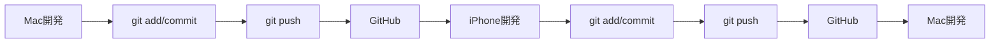

# 🔄 Mac + iPhone 開発ワークフロー

## 概要
GitHubとローカル環境の連携について、Mac（自宅）とiPhone（外出先）での開発サイクルガイド

## 現在のプロジェクト情報
- **リポジトリ**: `babadocomodake/hello-world`
- **メインブランチ**: `main`
- **現在のブランチ**: `cursor/explore-mobile-connection-capabilities-0463`

## 🔄 基本的な開発フロー



## 1. 自宅（Mac）での開発サイクル

```bash
# 1. 最新の変更を取得
git pull origin main

# 2. 新しい機能ブランチを作成
git checkout -b feature/new-feature

# 3. コード開発
# ... MacのIDEで開発作業 ...

# 4. 変更をコミット
git add .
git commit -m "feat: 新機能の実装"

# 5. リモートにプッシュ
git push origin feature/new-feature

# 6. 必要に応じてPRを作成
```

## 2. 外出先（iPhone）での開発サイクル

```bash
# 1. 最新の変更を取得
git pull origin main

# 2. 既存のブランチに切り替え or 新しいブランチ作成
git checkout feature/new-feature
# または
git checkout -b feature/mobile-fixes

# 3. iPhone用エディタで開発
# ... Cursor/VS Code Mobile等で編集 ...

# 4. 変更をコミット
git add .
git commit -m "fix: モバイルでの微修正"

# 5. リモートにプッシュ
git push origin feature/new-feature
```

## 3. 推奨ワークフロー戦略

### 🎯 ブランチ戦略
- `main`: 安定版
- `develop`: 開発用統合ブランチ
- `feature/機能名`: 機能開発用
- `hotfix/修正名`: 緊急修正用

### 📱 デバイス別の使い分け
- **Mac**: 大きな機能開発、リファクタリング
- **iPhone**: バグ修正、小さな変更、レビュー

### 🔄 実際のサイクル例

**朝（Mac）:**
```bash
git checkout main
git pull origin main
git checkout -b feature/user-auth
# 認証機能の基本実装
git add .
git commit -m "feat: 認証機能の基本実装"
git push origin feature/user-auth
```

**昼休み（iPhone）:**
```bash
git checkout feature/user-auth
git pull origin feature/user-auth
# エラーハンドリングの追加
git add .
git commit -m "fix: エラーハンドリング追加"
git push origin feature/user-auth
```

**夜（Mac）:**
```bash
git checkout feature/user-auth
git pull origin feature/user-auth
# テスト追加とドキュメント更新
git add .
git commit -m "test: 認証機能のテスト追加"
git push origin feature/user-auth
# PRを作成してマージ
```

## 4. 便利なツール・設定

### iPhone用開発環境
- **Cursor**: Web版でGitHub連携
- **GitHub Mobile**: PR確認・レビュー
- **Working Copy**: iOSのGitクライアント

### 同期を確実にするコマンド
```bash
# 作業前の必須コマンド
git status
git pull origin main

# 作業後の必須コマンド
git add .
git commit -m "作業内容の説明"
git push origin ブランチ名
```

## 5. 注意点・ベストプラクティス

### ✅ DO:
- 作業前に必ず`git pull`
- 小さな単位でコミット
- コミットメッセージは日本語でOK
- 定期的にバックアップとしてプッシュ

### ❌ DON'T:
- 大きな変更をコミットしない
- force pushは避ける
- 他のブランチで作業中に切り替えない

## 6. 実際の設定手順

### 初回設定
```bash
# 1. mainブランチに移動
git checkout main
git pull origin main

# 2. 開発用ブランチの作成
git checkout -b develop
git push origin develop

# 3. 機能開発用ブランチの作成
git checkout -b feature/初期設定
```

### 日常的な使用
```bash
# 毎日の開始時
git checkout main
git pull origin main
git checkout develop
git pull origin develop

# 新しい機能開発時
git checkout -b feature/新機能名
```

## 7. トラブルシューティング

### よくある問題と解決方法

**問題1: 競合が発生した場合**
```bash
git pull origin main
# 競合を手動で解決
git add .
git commit -m "fix: 競合を解決"
```

**問題2: 間違ったブランチにコミットした場合**
```bash
# 最新のコミットを取り消し（変更は保持）
git reset --soft HEAD~1
git checkout 正しいブランチ
git add .
git commit -m "正しいブランチでコミット"
```

---

*このガイドは随時更新されます。質問があれば気軽にお聞きください！*